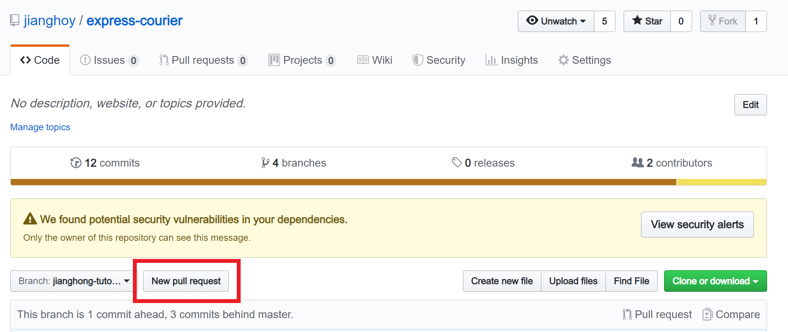
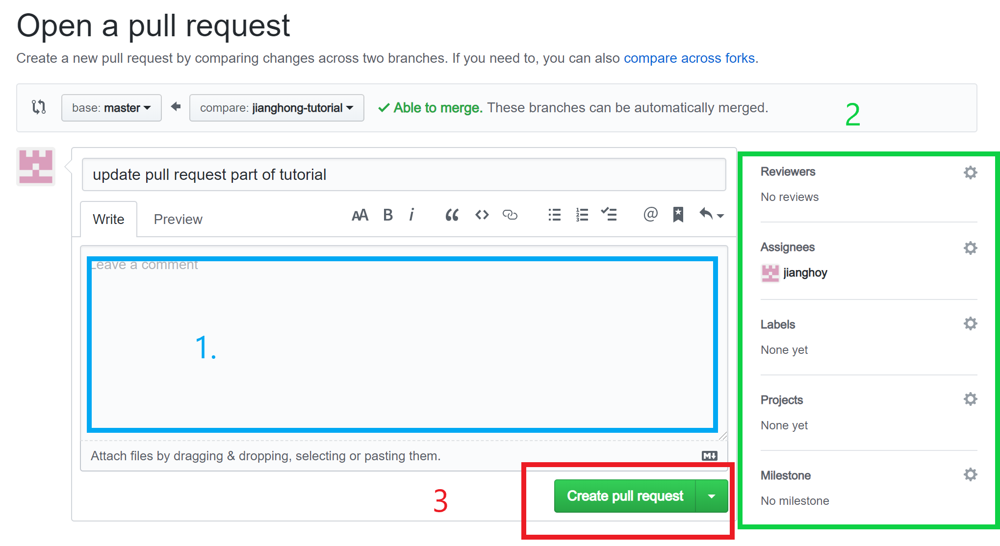

# Git & Github

## Branching

TBD

## How to create my own branch and push onto Github

First you need to use `checkout` command of `Git` to switch between branches (mostly your branch and master). When create your branch, use:

```bash
git checkout -b your_branch_name
```

`git checkout branch_name` is used when switching between branches and `-b` means create a branch.

The rest is mostly the same except when you push:

```bash
git push origin your_branch_name
```

You can only push your branch onto remote server's your branch (which makes sense) so you have to specify the branch name.

## How to create a pull request

While collaborators can directly push onto `master` branch I strongly discourage this sort of action. Codes should be reviewed and tested before merge into `master` branch. So we should use `pull request`.



1.First switch branch to your branch(on the left of red box); press `New pull request` branch.


2. In the pull request page, first write down your comment (blue box)
  
3. Use green box bo pick some properties, most importantly the `Assigness`(your name) and `Labels`.

4. Create pull request!(red box)
